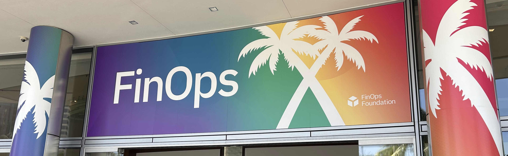
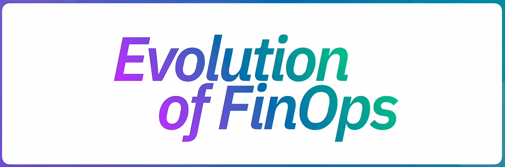
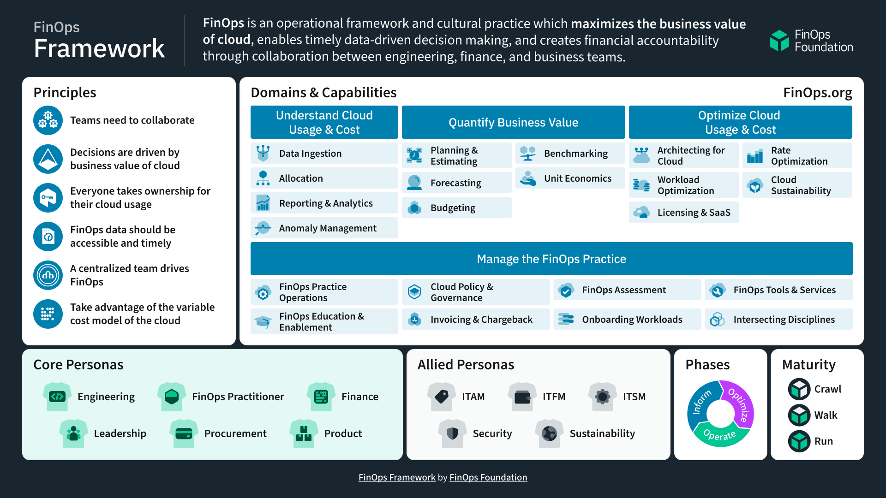
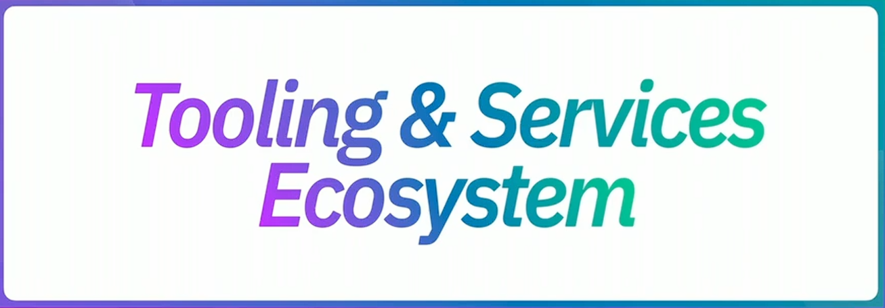
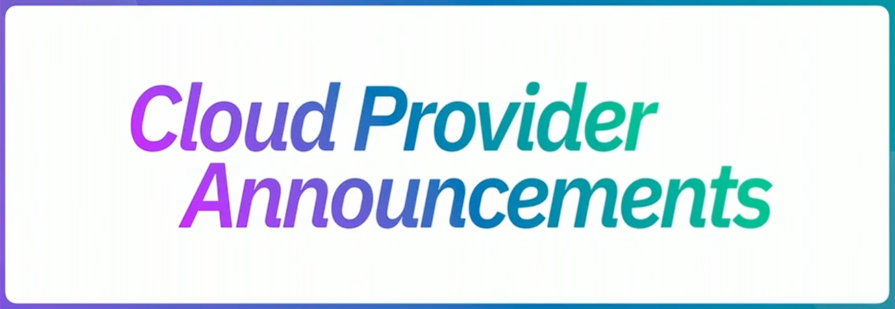

<!-- omit in toc -->
# FinOps Foundation最大のグローバルイベント「FinOps X 2024」開催、最新の技術動向や事例を幅広く紹介

2024年6月19日から22日の4日間、FinOps Foundationはグローバル最大のイベントである「FinOps X 2024」が米国サンディエゴで開催されました。本記事ではそちらのカンファレンスを通じて得られた最新の技術動向や事例などについて紹介します。

## 概要

FinOpsは「Finance」と「DevOps」を掛け合わせた言葉で、クラウドへ支払う料金に対し、クラウドから得られる価値を最大化することを目的とした運用フレームワークで、組織文化に変革をもたらす取り組みの1つです。FinOps Xは、このFinOpsを実践する人々の支援を目的とする非営利団体のFinOps Foundationが主催する最大のグローバルイベントで、世界各国からFinOpsに携わる人々や企業が集まり、最新の技術動向や事例などの学習や人脈づくりなどの機会を提供するカンファレンスとなっています。このFinOps X 2024が、2024年6月19日から22日の4日間に渡って、米国サンディエゴで開催されました。

本記事では、FinOps X 2024で行われたセッションのうち、20日、21日の朝一番に行われた基調講演で発表された最新動向や事例について紹介します。

## FinOpsの進化

Day1基調講演の最初は、FinOps FoundationのCEOであるJ.R. Storment氏から「Evolution of FinOps」のタイトルで、この1年間でFinOpsがどのように進化したのかについて次の6つのテーマに沿って紹介がありました。

- FinOpsは全員の仕事である
- 設計の初期段階からコストを意識した意思決定を
- パブリッククラウドの枠を超えて
- カーボンも意識したFinOps
- AIをFinOpsへ、AIへFinOpsを
- 常に変化していて終わりはない

とくに印象的だったのは、FinOpsの活動がとうとうパブリッククラウドの枠を超えて、プライベートクラウドなどの世界にも適用が進められてきているということでした。もともとはオンプレミスの頃にはなかったパブリッククラウド特有のコスト最適化、クラウドコスト管理という概念から始まったのがFinOpsです。そのため、このあとのUberの基調講演でも語られている通り、このFinOpsの活動がパブリッククラウドの枠を超えてきたというのは1つの節目を迎えたことを意味しているのではないでしょうか。

なお、2024年に更新されたFinOpsフレームワークの詳細については、FinOps Foundation公式ブログの「[Key 2024 Changes to the FinOps Framework](https://www.finops.org/insights/2024-finops-framework/)」にまとめられています。興味のある方は理解をより深めるためにも、ぜひこちらもあわせて参照することをオススメします。

*出典：FinOps Founcation、[the 2024 Revision of the FinOps Framework](https://www.finops.org/insights/2024-finops-framework/)*

## FinOpsはもはや特定のチームだけの仕事ではない

Day1基調講演の2つ目のセッションは、DisneyのFinOpsチームのマネージャーであるElly Rauch氏から「Burn down the Past – Forecasting at Disney」のタイトルで、クラウドコスト予測のプロセスを例に挙げて、今ではすべてのチームが連携を取ってFinOpsが全員の仕事になったDisneyの事例についての紹介がありました。

このセッションでは、古い縦割りの慣習を打ち破り、FinOpsフレームワークの[設計原則](https://www.finops.org/framework/principles/)にも定義されているように、ファイナンスチームやエンジニアリングチームがコストの最適化とビジネスの収益性に対して共通の目標を持ち、誰もがクラウドの使用にオーナーシップを持つ文化へと変えていくことの重要性を伝えていました。

またRauch氏は、FinOpsは絶え間ない変化のために設計された継続的な反復ループであることから、ウォルト・ディズニー氏の「ディズニーランドは永遠に完成しない。この世界に創造力が残っている限り、成長し続ける。」という言葉を引用し、今後もDisneyにおけるFinOpsの活動も常に成長を続けていくと力強い宣言を行っていました。

## パブリッククラウドの枠を超えて

Day1基調講演の3つ目のセッションは、UberのSarah Keller氏とChavis Richardson氏から「FinOps Beyond Public Cloud at Uber (with Invoice Bots!)」のタイトルで、過去に発生した誤課金の対策として請求情報に誤りがないかを検出するボット活用に関する紹介と、パブリッククラウドの世界を超えたFinOpsの活動に関する紹介がありました。

このセッションでとくに印象的だったのは、Uberのサービス提供を支える超巨大なマルチクラウド環境において、2023年に発生した誤請求が全体のクラウド支出の6.7%もの数字に上がっていたという発言でした。誤請求は申告することで返金を得ることができるものの、裏を返せばしっかりご請求を認知し、申告をしない限りは返金を得ることが困難であるとも言えます。そのため、とくに大規模なクラウド環境を運用するチームでは、クラウドプロバイダーから出てきた課金請求情報を鵜呑みにせず、本当に正しいのかをしっかり分析することが重要になってきます。

セッション後半のパブリッククラウドの枠を超えて実践されているFinOpsについては、配車サービスのUber X、Uber Motoなどの乗り物の種類ごとに細かなコスト配賦を行うことによって運賃の適正化などを実施しているといった内容のお話がありました。

## 迅速な意思決定には統一で正確な情報源が必要である

Day1基調講演の4つ目のセッションは、FinOps FoundationのJ.R. Storment氏とGitlabのClément Leroux氏から「FOCUS 1.0 GA Launch with Gitlab」のタイトルで、FinOps Open Cost & Usage Specification(FOCUS)のバージョン1.0正式リリースの告知と、FOCUSによって解決される課題についての紹介がありました。

FOCUSは、FinOps Foundation主導で各クラウドプロバイダーが協力して作り上げたクラウドのコストと使用量の課金データに関するオープンソースの技術仕様で、クラウドプロバイダー各社のクラウド請求書のデータフォーマットを統一規格で扱えるようにするものです。主要なクラウドプロバイダーはすでに対応しており、今後は主要なSaaSプロバイダーなどへと広がっていくことが見込まれているとのことでした。

*出典：FinOps Founcation、[the 2024 Revision of the FinOps Framework](https://www.finops.org/insights/2024-finops-framework/)*

また、GitLabではマルチクラウドを運用するにあたって、コストを意識した迅速な意思決定のために統一で正確な情報源を構築する必要がある一方で、クラウドごとの課金フォーマットや用語の違いなどから発生するコスト管理の複雑さに関する課題を抱えていたとのことでした。しかし、FOCUSの登場により、課金フォーマットの差分を吸収するためのデータ加工などの労力から解放され、より迅速な意思決定が実現できる見込みだとFOCUSへの期待を語っていました。

なお、FOCUSの詳細については、FinOps Foundation公式の学習コンテンツの「[FOCUS入門コース(無償)](https://learn.finops.org/introduction-to-focus)」や、ブログの「[FOCUS 1.0 is Now Available. Practitioners and Clouds Continue Adoption.](https://www.finops.org/insights/focus-1-0-available/)」にまとめられています。興味のある方は、ぜひこちらもあわせて参照することをオススメします。

## 3大クラウドのVPが語るFinOpsの将来

Day1基調講演の最後のセッションは、FinOps FoundationのJen Hayes氏を司会に、Google CloudのPravir Gupta氏、MicrosoftのSrivatsan Kidambi氏、AWSのJames Greenfield氏の3名によるパネルディスカッションでした。

パネルディスカッションでは、FinOpsに対する顧客のニーズの変化、AIによるFinOpsへの影響、今後数年間で進むと予想される将来についてなどが話し合われました。とくにFOCUSによるデータ統合の未来、AIはFinOpsの世界にも今もそしてこれからも大きな影響を与えるであろうということ、そしてFinOpsとサステナビリティとの調和について、各社とても意識をしているということがわかる内容だったのが印象的でした。

## FinOpsの活動に誇りをもって行える文化

Day2基調講演の1番目のセッションは、FinOps FoundationのJ.R. Storment氏を司会に、American ExpressのKeena Blunschi氏とNoreen Dever氏を迎えた座談会の形式で開催されました。

座談会の後半に語られたAmerican ExpressにおけるFinOpsの取り組みとして、エンジニア主導でゲーミフィケーションを導入し、コスト最適化を単なる面倒な作業から、成果が正しく称賛される楽しいチャレンジへと変化させる仕掛け作りが進められているといった内容のお話がありました。座談会の中では、FinOps成熟度モデルで言えばまだまだ一番下のレベル（Crawl）の状態かも知れないといった発言はあったものの、チームの1人1人がFinOpsの活動に誇りを持って行える組織文化の醸成こそが一番重要なのではないか、と考えさせられるセッションでした。

## 神話上の生き物を追い求めるのはやめよう

Day2基調講演の2番目のセッションは、FinOps FoundationのCTOであるMike Fuller氏から「Tooling & Services Ecosystem」のタイトルで、ツールやサービスを選定する際の考え方について紹介がありました。

このセッションでは、自社のニーズに完全に合致した「神話上の生き物」を追い求めるのではなく、さまざまなツール/サービスが市場にはあるため、ニーズに合わせて適切なソリューションをパズルのように組み合わせることが重要であると述べておりました。

なお、ツールやサービスに関する詳細については、FinOps Foundation公式ホワイトペーパーの「[FinOps Tools and Services](https://www.finops.org/wg/finops-tools-and-services/)」にまとめられています。興味のある方は理解をより深めるためにも、ぜひこちらもあわせて参照することをオススメします。

## 3大クラウドの最新FinOps機能/サービスのご紹介

Day2基調講演の3番目のセッションでは、3大クラウドにおける新しいFinOpsサービスや機能についての発表が行われました。各クラウドプロバイダーの発表1つ1つがとても面白く、得るものの多いセッションだったものの、とくに3大クラウドすべてに共通し、次のような機能/サービスの発表が行われていた点は注目に値すると考えています。

- FOCUS形式での出力に対応し、他ベンダーのFOCUSデータも扱えるようになったこと
- AIによるFinOpsアシスト機能をサポートしたこと
- カーボンデータもダッシュボードに統合されたこと、など

個人的には、新しい機能やサービスの発表は、各クラウドプロバイダーが主催する個々のイベントで、個々に行われることが多い印象がありました。そのため、FinOps Xのように1つのテーマに対し、各プロバイダーが横並びで機能/サービスを紹介するといった場面はとても斬新で、かつユーザー目線から見るととても有意義なものに感じました。FinOps Foundationの公式YouTubeアカウントにて本セッションの動画が公開されましたら、ぜひ見ていただくことをオススメします。

## 次回のイベントについて

Day2基調講演の最後のセッションでは、FinOps FoundationのJ.R. Storment氏とMike Fuller氏が再び壇上にあがり、次回イベントしてFinOps X Europe 2024が、2024年11月11日から14日の4日間に渡ってスペインのバルセロナで開催されること。FinOps X 2025が、来年の6月第一週に米国サンディエゴで予定されていることについて発表がありました。

FinOps X Europe 2024に合わせてFOCUS v1.1のリリースも計画されていますし、来年はどのようにFinOpsが進化しているのか、今からとても楽しみに感じています。

## 最後に

本イベントレポートでは触れていませんが、本イベントでは60を超えるブレイクアウトセッションも行われており、質疑が盛り上がり時間いっぱいまでセッション会場に留まるケースも多く、終始熱気に包まれていました。またイベント期間中は、FinOps Foundation公式のレセプションパーティーやスポンサー主催のナイトイベントなどの人と人との交流の場も多く提供されており、FinOpsを実践するもの同士の苦労話などで話の花を咲かせていました。

一方、日本ではFinOps自体はまだまだこれからといった印象で、実際、日本からFinOps X 2024へ参加されている方もおそらく片手に収まる程度しかいなかったと感じています。しかし、FinOps X 2024を通じて、グローバルではとても盛り上がりを見せていることを肌で感じ、やや遅れてではあるものの近い将来、日本でも盛り上がりを見せてくるのではないかと推測しています。

もしFinOpsへ興味を持たれた方がおりましたら、現在日本の有志でFinOpsコミュニティの立ち上げを画策していますので、ぜひこの機会にコミュニティ活動への参加を検討してみてはいかがでしょうか。日本のFinOps業界を一緒に盛り上げていきましょう。

最後に、今回ご紹介した基調講演やブレイクアウトセッションの動画については、順次FinOps Foundationの[公式YouTubeアカウント](https://www.youtube.com/@finopsfoundation)にて公開されていきますので、気になった方はぜひチェックしてみてください。

以上、FinOps X 2024カンファレンスを通じて得られた最新の技術動向や事例などについてのご紹介でした。
